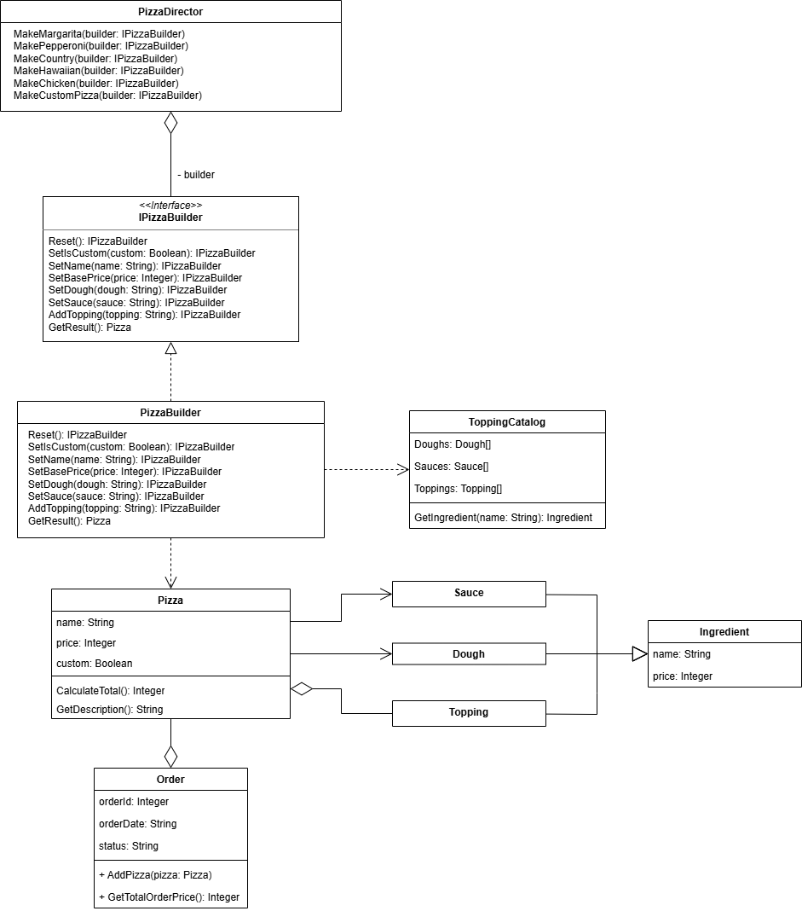

**1. Описание проблемы предметной области**  

В системе заказа пицц клиенты могут конструировать пиццы с различными комбинациями ингредиентов: тесто, соус, сыр, мясо, овощи и другие топпинги. При этом существуют как готовые рецепты (Маргарита, Пепперони, Кантри), так и возможность создания индивидуальной пиццы через конструктор. Прямое создание объекта `Pizza` через конструктор привело бы к передаче большого количества параметров (18 и более), что сильно мешает каким либо образом модернизировать код. Кроме того, необходимо обеспечить возможность создания различных вариаций пицц без дублирования кода и с возможностью лёгкого добавления новых рецептов и ингредиентов.

**2. Решение: использование паттерна Builder**  

Для решения задачи был применен порождающий паттерн проектирования «Builder» (Строитель), позволяющий поэтапно конструировать сложные объекты, отделяя процесс построения от представления объекта. На рисунке 1 изображены реализованный интерфейс `IPizzaBuilder` с методами пошаговой сборки, класс `PizzaBuilder`, который хранит экземпляр продукта и реализует методы интерфейса, а также класс `PizzaDirector`, который управляет процессом построения и хранит рецепты готовых пицц. Это позволяет инициировать создание пиццы на основе заранее настроенного алгоритма (рецепта), сохраняя логику конструирования инкапсулированной в строителе.  

||
|:--------------------------------------:|
|Рисунок 1|  

**3. Вывод: влияние паттерна на работу программы**  

Внедрение паттерна Builder усложнило архитектуру проекта за счёт введения дополнительных классов (`IPizzaBuilder`, `PizzaBuilder`, `PizzaDirector`) и интерфейсов. Однако эта сложность оправдана: система стала значительно гибче и готовой к масштабированию без переписывания существующего кода. Добавление новых типов пицц теперь сводится к добавлению нового метода в `PizzaDirector`, а не к изменению логики формы или класса `Pizza`, аналогично для ингредиентов - достаточно добавить его в список ингредиентов и можно использовать в рецептах. Каждый созданный объект пиццы проходит через процесс построения, что исключает ошибки создания некорректных объектов. Таким образом, паттерн обеспечил лучшую расширяемость и читаемость кода.