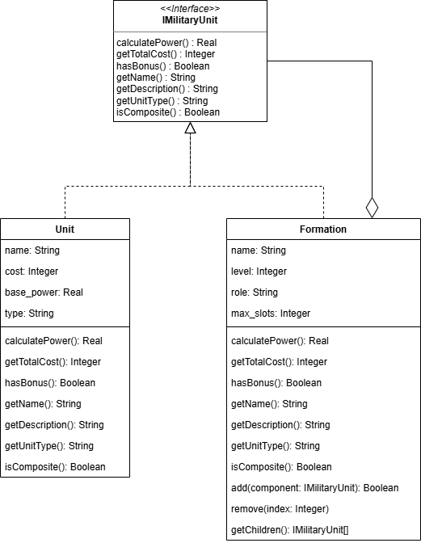
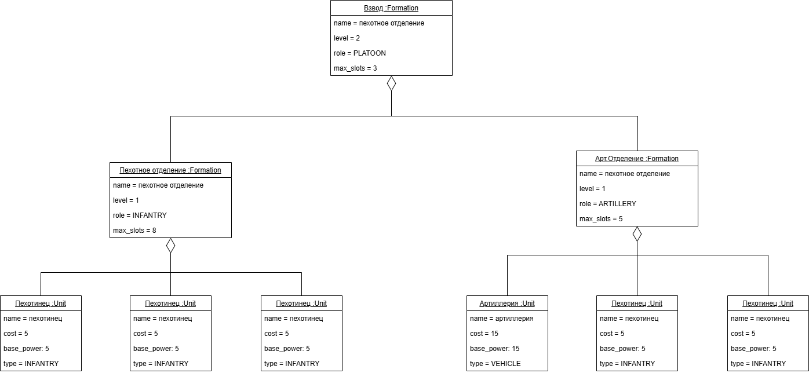

# Лабораторная работа: паттерн Компоновщик (Composite)

## 1. Описание проблемы

В игре *COMMANDER* игрок выступает в роли командира подразделения. Он управляет боевыми единицами: отдельными юнитами (танки, пехота, артиллерия) и формированиями (взводы, роты, батальоны), которые могут содержать как отдельные юниты, так и другие формирования. Командиру необходимо рассчитывать общую боевую мощь, стоимость, учитывать бонусы и выводить структуру подразделения.

Без применения паттерна разработчики создали бы отдельные классы для простого юнита и для формирования. Каждый класс имел бы свои методы для расчёта характеристик:

- `Unit` – хранит имя, стоимость, базовую силу, тип. Реализует методы расчёта силы и стоимости, но не умеет работать с вложенностью.
- `Formation` – хранит список юнитов, но для расчёта общей силы приходится вручную перебирать всех детей и суммировать их показатели. При добавлении нового типа юнита (например, «Поддержка») или изменении правил расчёта бонусов код формирования становится громоздким и подвержен ошибкам.

Такой подход приводит к дублированию кода: логика расчёта силы и стоимости для простого юнита и для группы не унифицирована. Клиент (командир) вынужден различать, с чем он работает – с одним юнитом или с целым отрядом, что нарушает принцип единообразия и усложняет добавление новых видов боевых единиц.

## 2. Решение: применение паттерна Компоновщик

Паттерн **Компоновщик (Composite)** позволяет сгруппировать объекты в древовидные структуры для представления иерархий «часть-целое». Он даёт возможность клиенту единообразно работать как с отдельными объектами (листьями), так и с их композициями (контейнерами)..

В проекте введены:

- **`IMilitaryUnit`** – общий интерфейс для всех компонентов. Содержит методы:
    - `calculatePower(): Real` – вычисление общей боевой мощи.
    - `getTotalCost(): Integer` – общая стоимость.
    - `hasBonus(): Boolean` – наличие бонуса.
    - `getName(): String`, `getDescription(): String`, `getUnitType(): String` – получение информации.
    - `isComposite(): Boolean` – идентификация, является ли компонент контейнером.

- **`Unit`** – лист (лист дерева). Реализует интерфейс `IMilitaryUnit`. Представляет отдельный боевой юнит (танк, солдата и т.д.). Хранит собственные атрибуты: имя, стоимость, базовую силу, тип.

- **`Formation`** – компоновщик. Реализует `IMilitaryUnit`, а также дополнительные методы управления дочерними компонентами:
    - `add(component: IMilitaryUnit): Boolean` – добавить компонент.
    - `remove(index: Integer)` – удалить по индексу.
    - `getChildren(): IMilitaryUnit[]` – получить список детей.

Ключевой момент – методы расчёта характеристик в `Formation` делегируют выполнение дочерним компонентам и агрегируют результаты.

Клиент работает с указателем на интерфейс `IMilitaryUnit*` и не заботится о том, является ли объект простым юнитом или целой группой. Рекурсивная структура позволяет легко строить иерархию любой глубины.

## 3. Диаграммы

||
|:--------------------------------------:|
|Рисунок 1. Реализация паттерна|  

||
|:--------------------------------------:|
|Рисунок 2. Конкретный пример возможной иерархии объектов|  

## 4. Сравнение: без паттерна и с паттерном

### 4.1 Без паттерна (раздельные классы)

При добавлении нового типа (например, `SupportUnit`) потребуется дописывать отдельные перегрузки или ветвления `if (type == ...)`. Код разрастается и сильно дублируется, что критично при последующих изменениях проекта.

### 4.2 С паттерном Composite

Единый интерфейс `IMilitaryUnit` позволяет клиенту работать однотипно. 
Метод `showPower` не требует изменений при появлении новых типов юнитов или формирований. Все сложности рекурсивного обхода скрыты внутри `Formation`.

Сравнение характеристик подхода:

| Характеристика | Без Composite | С Composite |
|----------------|---------------|-------------|
| Количество клиентских методов для расчёта силы | по одному на каждый тип | один общий метод |
| Поддержка вложенности произвольной глубины | требуется ручной обход | автоматическая рекурсия |
| Добавление нового типа юнита | требует доработки клиентского кода | не требует изменений (новый тип реализует интерфейс) |
| Сложность кода формирования | высокая (много циклов и суммирований) | низкая (делегирование детям) |

## 5. Вывод

Применение паттерна Компоновщик в игре *COMMANDER* позволило:

- **Унифицировать интерфейс** – единый набор методов для любых боевых единиц, будь то одиночный танк или целая дивизия.
- **Упростить клиентский код** – командир работает с `IMilitaryUnit*`, не заботясь о внутренней структуре.
- **Облегчить добавление новых типов** – достаточно реализовать интерфейс `IMilitaryUnit`; остальной код остаётся неизменным.
- **Поддержать глубокую вложенность** – формирование может содержать другие формирования, и все операции рекурсивно распространяются по дереву.
- **Избавиться от дублирования логики** – расчёт силы, стоимости и бонусов реализован в каждом компоненте самостоятельно; контейнер только агрегирует результаты детей.

Функциональность игры осталась прежней, но внутренняя архитектура стала более гибкой, масштабируемой и удобной для поддержки. Паттерн Компоновщик идеально подходит для задач, где объекты естественным образом образуют иерархии «часть-целое».