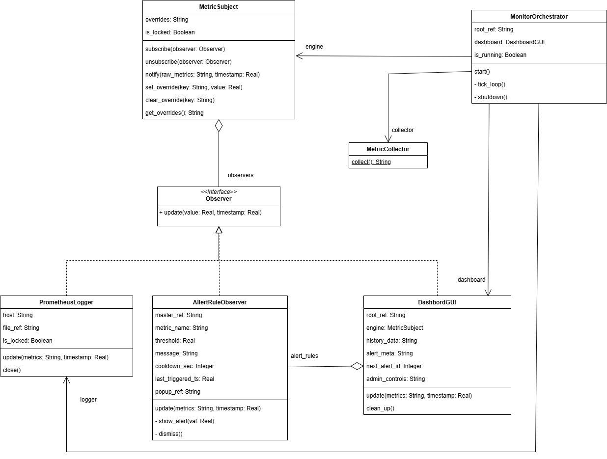

# Документация: Паттерн «Наблюдатель» в системе мониторинга ресурсов

## Описание проблемы

Требуется система, которая каждую секунду собирает метрики (CPU, RAM, диск), отображает их на графиках в реальном времени, логирует в Prometheus-формате, показывает всплывающие алерты при превышении порогов и позволяет администратору принудительно переопределять значения.

Основная сложность — множество разнородных действий, которые нужно выполнять с каждым новым набором метрик. Прямые вызовы всех компонентов из главного цикла приводят к жёсткой связности: добавление нового модуля (например, отправки в Telegram) требует изменения существующего кода. Глобальное состояние делает программу трудно тестируемой и расширяемой.

## Решение: Паттерн «Наблюдатель» (Observer)

**Роли:**
- **Subject** (`MetricSubject`) — хранит список наблюдателей, применяет оверрайды к метрикам, рассылает итоговые значения через `notify()`.
- **Observer** (абстрактный класс) — объявляет метод `update(metrics, timestamp)`.
- **Concrete observers** — `PrometheusLogger` (запись в файл), `AlertRuleObserver` (проверка условий и попап), `DashboardGUI` (обновление графиков и управление алертами).

**Взаимодействие:**
1. Оркестратор создаёт субъект и наблюдателей, подписывает их.
2. По таймеру собираются сырые метрики → вызывается `subject.notify(raw, ts)`.
3. Субъект накладывает активные оверрайды и вызывает `update()` у всех подписанных наблюдателей.
4. Каждый наблюдатель выполняет свою задачу (логирование, проверка алерта, отрисовка графика).

## Диаграмма классов

*Вставлено изображение, нарисованное вручную в визуальном редакторе.*

## Вывод: влияние внедрения паттерна

**До применения Observer (hardcode-версия):**  
Все компоненты вызывались напрямую из `tick_loop`, глобальный словарь `_global_state` связывал всё воедино. Добавление новой функциональности требовало правки цикла и глобального состояния.

**После внедрения Observer:**  
- Главный цикл стал лаконичным — только `collect()` и `notify()`.
- Новые наблюдатели подключаются через `subscribe()` без изменения существующего кода.
- Оверрайды централизованы внутри субъекта.
- Код стал тестируемым (можно замокать наблюдателей).
- Появилась единая дисциплина оповещения об изменениях.

**Компромиссы:** незначительное усложнение кода (дополнительные классы) и необходимость синхронизации при многопоточности.

**Итог:** паттерн Observer полностью соответствует задаче «один источник событий — множество реакций». Его применение превратило монолитную программу в гибкую, расширяемую архитектуру.
