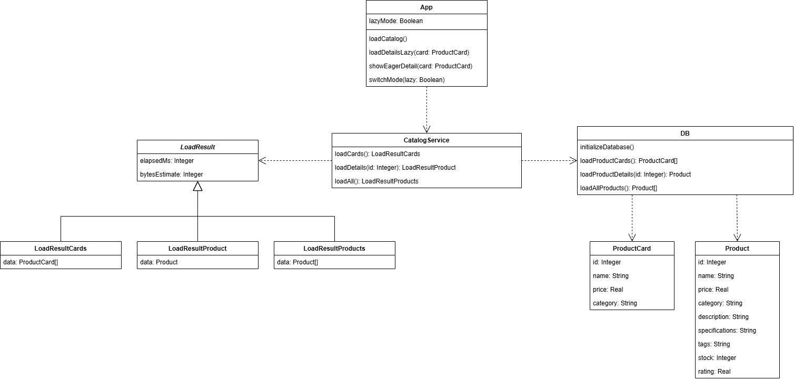

# Документация: Паттерн «Загрузка по требованию / Ленивая загрузка» в каталоге товаров

## Описание проблемы

Требуется приложение каталога товаров, которое получает данные из базы и отображает список продуктов с возможностью просмотра детальной информации. Каждый товар содержит как базовые данные (название, цена, категория), так и расширенные характеристики (описание, спецификации, теги, рейтинг, остаток на складе).

Основная сложность заключается в объёме загружаемых данных. Если сразу загружать полную информацию обо всех товарах, увеличивается время запуска приложения, возрастает нагрузка на память и базу данных. Если же загружать данные только по требованию, необходимо организовать дополнительный механизм дозагрузки.

Прямое получение всех полей для каждого товара приводит к избыточному потреблению ресурсов, особенно при большом каталоге.

---

## Решение: Паттерн «Ленивая загрузка» (Lazy Loading)

**Роли:**

- **Client** (`App`) — инициирует загрузку данных и переключает режим работы между Lazy и Eager.
- **Service** (`CatalogService`) — управляет сценарием загрузки, определяет, какой тип запроса выполнить.
- **Data Source** (`DB`) — выполняет запросы к базе данных и формирует объекты доменной модели.
- **Lightweight Object** (`ProductCard`) — облегчённое представление товара, содержащее только основные данные.
- **Full Object** (`Product`) — полная модель товара, содержащая все характеристики.

---

## Взаимодействие

### Режим Lazy Loading

1. Клиент вызывает `CatalogService.loadCards()`.
2. Сервис запрашивает у базы только основные поля товара.
3. База данных формирует список объектов `ProductCard`.
4. При выборе конкретного товара клиент вызывает `CatalogService.loadDetails(id)`.
5. База данных загружает полную информацию только по выбранному товару и возвращает объект `Product`.

---

### Режим Eager Loading

1. Клиент вызывает `CatalogService.loadAll()`.
2. Сервис выполняет полный запрос к базе данных.
3. База данных сразу формирует список объектов `Product`.
4. Последующие обращения происходят без повторных запросов к базе данных.

---

## Диаграмма классов

---

## Вывод: влияние внедрения паттерна

### До применения Lazy Loading (Eager-only версия)

Все товары загружались полностью при запуске приложения:

- увеличивалось время старта;
- росло потребление памяти;
- база данных выполняла тяжёлый запрос, даже если пользователь просматривал только несколько товаров.

---

### После внедрения Lazy Loading

- При запуске загружаются только лёгкие карточки товаров.
- Полная информация подгружается только по запросу пользователя.
- Снижается объём первоначально передаваемых данных.
- Уменьшается нагрузка на базу данных и оперативную память.
- Повышается отзывчивость интерфейса при работе с большими каталогами.

---

## Компромиссы

Использование паттерна приводит к дополнительным обращениям к базе данных при открытии деталей товара. Также усложняется логика работы сервисного слоя, так как требуется поддерживать несколько стратегий загрузки данных.

---

## Итог

Паттерн **Lazy Loading** полностью соответствует задаче оптимизации загрузки данных в каталожных приложениях. Его применение позволяет эффективно работать с большими объёмами информации, снижать нагрузку на систему и загружать только действительно необходимые данные в нужный момент.